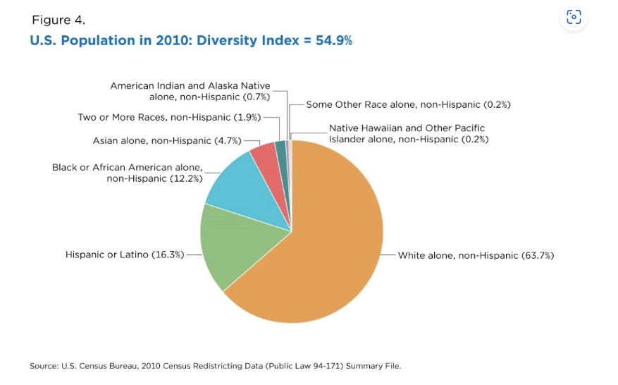

### Introduction

An introduction of the problem domain and a description of the variable(s) 
you are choosing to analyze (and why!)

***

Maintaining a just and fair criminal legal system is a pillar of the 
United States' values. As such, it is important to perform routine checkups on 
the fairness of the US criminal legal system, namely its racial incarceration 
rates. Incarceration is a multifaceted issue that significantly impacts 
individuals, families, and communities. By using the Vera Institute of Justice's 
Incarceration Trends data set, we can gain invaluable insights into potential 
disparities, avenues for reform, and the current state of the US criminal legal 
system at both county and state levels. 

Some variables worth considering that can be calculated from this data set 
include:

* What is the average jail rate of the LatinX population?

* What is the average jail rate of the White population?

* How has the jail rate changed in the past decade in the US for the
LatinX community? 

* How has the jail rate changed in the past decade in the US for the
White community?

* Which state has the greatest difference of jail rates between the Latinx and 
White racial groups?

### Summary Information

```{r, echo = FALSE, include = FALSE}
# Load results from summary.R
source("summary.R")

```

Write a summary paragraph of findings that includes the 5 values calculated 
from your summary information R script

These will likely be calculated using your DPLYR skills, answering questions 
such as:

- What is the average value of my variable across all the counties (in the 
current year)?
- Where is my variable the highest / lowest?
- How much has my variable change over the last N years?

Feel free to calculate and report values that you find relevant. Again, remember 
that the purpose is to think about how these measure of incarceration vary 
by race.

***

Using data from the Vera Institute of Justice's Incarceration Trends within 
the United States dataset, we compared the incarceration rates between the 
LatinX and White communities, which are the two largest populations within 
the country. 


The analysis revealed a significant disparity between these two communities. 
average, the LatinX community experienced a higher **incarceration rate of 
`r avg_latinx_jail` people jailed per 100,000**, while the White community's 
**average was lower at `r avg_white_jail` people jailed per 100,000**.

Moreover, when comparing the two groups, the data shows that 
**`r avg_wl_jail_diff` more LatinX individuals are incarcerated per 100,000 
residents** in the US compared to their White counterparts.

Over time, the incarceration rates for both communities displayed distinct 
trends. The average number of people jailed per 100,000 **decreased by 
`r avg_latinx_jail_diff * -1`** for the LatinX community. In contrast, 
the average incarceration rate for the White community **increased by 
`r avg_white_jail_diff`**, reflecting a rise in comparison to the past.

These findings highlight the disparities in the US criminal justice system, 
emphasizing the need for further examination and efforts to address the 
inequities faced by the LatinX community in particular.


### The Dataset

Who collected the data?

* The data was collected/gathered by the Vera Institute of Justice, a national
research and policy organization based in the United States that works on 
transforming the criminal legal and immigration systems until they're fair for
all. 

How was the data collected or generated?

* The data was collected by gathering data from a multitude of other data sets. 
The Vera Institute uses data from the Bureau of Justice Statistics (BJS), 
the Census of Jails (COJ), the Annual Survey of Jails (ASJ), 
the Deaths in Custody Reporting Program (DCRP) and the National Corrections 
Reporting Program (NCRP) to create their Incarceration Trends data set.

Why was the data collected?

* The data was collected because it was the first national data set that 
can examined both jail and prison incarceration at the county level. Having a 
data set at this level of granularity is important because incarceration is 
usually decided by county officials, judges, wardens, and prosecutors. We can 
therefore use this data to see how decisions are made in communities across 
the U.S.

How many observations (rows) are in your data?

* There are 91031 observations (rows) in the data set.

How many features (columns) are in the data?

* There are 23 features (columns) in the data set.

What, if any, ethical questions or questions of power do you need to consider 
when working with this data?  

* As mentioned in *Data Feminism* by Catherine D'Ignazio and Lauren F. Klein, 
it is important reflect on the data we are working with. In terms of questions
of power and ethical questions, we must first understand that we are strangers
to the data set and it extremely difficult to know the origin, context, and 
lived experiences of each individual represented by the data. We must also 
understand that most of the data gathered come from national organizations with
positions of power. This means that it is likely that some perspectives are
not included within the data set. 

What are possible limitations or problems with this data?   (at least 200 words)

* 
While evaluating the fairness of the U.S. criminal justice system, it is 
important to recognize that this data set only uses race and gender as 
measurements. This selective approach can create a framing cognitive bias and 
is not a holistic representation of the complex U.S. criminal justice system. 
The assignment further restricts the dimensions of evaluation by focusing on 
only comparing racial incarceration rates. While this information provides 
valuable insights, it fails to consider other important aspects of the criminal 
justice system such as recidivism rates and experiences while incarcerated. 
Limiting the analysis to racial incarceration also overlooks other crucial 
factors, such as socioeconomic status, education, systemic policies, and 
culture/family which can also influence arrests and sentencing.
The dataset also doesn’t represent all racial groups as they exclude Asians, 
Native Hawaiians, and other Pacific Islanders. This means that the results 
from our data set cannot be generalized to “all racial groups.”
Furthermore, it fails to mention how people who belong to multiple races are 
represented. The lack of this information obscures the 
experiences of multiracial individuals within the criminal justice system. 
Finally, multiple N/A values which represent missing information within the 
dataset introduces uncertainty into the calculated values, potentially leading 
to skewed or incomplete assessments of counties and states. (209 words)


### Trends Over Time Chart

Include a chart. Make sure to describe why you included the chart, and what 
patterns emerged

The first chart that you will create and include will show the trend over 
time of your variable/topic. Think carefully about what you want to communicate 
to your user (you may have to find relevant trends in the dataset first!). 
Here are some requirements to help guide your design:

- Show more than one, but fewer than ~10 trends
  - This may mean showing the same measure for different locations or different 
  racial groups. Think carefully about a meaningful comparison of locations 
  (e.g., the top 10 counties in a state, top 10 states, etc.)
- You must have clear x and y axis labels
- The chart needs a clear title 
- You need a legend for your different line colors and a clear legend title

When we say "clear" or "human readable" titles and labels, that means that you 
should not just display the variable name.

Here's an example of how to run an R script inside an RMarkdown file:

***

```{r, echo = FALSE, code = readLines("chart1_example.R"), fig.width = 12}
# inserts first chart from char1_example.R
```

* This scatter plot is included to help visualize the trends of incarceration 
rates between the LatinX community and the rest of the United States. It 
highlights a decline in the LatinX jail rate per 100,000 residents, contrasted 
with a steady increase in incarceration rates for the rest of the United States. 
However, it's essential to also notice that the LatinX jail rate remains 
significantly higher than both the US and White averages. By presenting these 
trends visually, we can gain a better perspective on the disparities and 
changes in incarceration rates among different racial groups in the country.

### Variable Comparison Chart

Include a chart. Make sure to describe why you included the chart, and what 
patterns emerged

The second chart that you will create and include will show how two different 
(continuous) variables are related to one another. Again, think carefully about 
what such a comparison means and what you want to communicate to your user 
(you may have to find relevant trends in the dataset first!). Here are some 
requirements to help guide your design:

- You must have clear x and y axis labels
- The chart needs a clear title 
- If you choose to add a color encoding (not required), you need a legend for 
your different color and a clear legend title

***

```{r, echo = FALSE, code = readLines("chart2_example.R"), fig.width = 12}
# inserts second chart from char2_example.R

```

* This scatter plot is included to help visualize the trends of incarceration 
rates between the LatinX community and the rest of the United States in 
urban areas. This is an important statistic to look at since the [Joint
Economic Committee](https://www.jec.senate.gov/public/_cache/files/f16b51b0-5f61-43a6-9428-8835d0ad6a7c/economic-state-of-the-latino-community-in-america-final-errata-10-15-2019.pdf). states that over 90% of the Latino community in America resides in metropolitan
areas. By visualizing the trends of incarceration within urban areas we can 
see that the LatinX jail rate per 100,000 people in urban areas is consistently 
lower than the US jail rate per 100,000 people in urban areas.
It also highlights a decline in the LatinX jail rate per 100,000 residents, 
along with the rest of the United States This insight can help policymakers
better understand the dynamics of incarceration rates in urban areas and 
potentially identify areas for improvement in the criminal justice system.


### Map

Include a chart. Make sure to describe why you included the chart, and what 
patterns emerged

The last chart that you will create and include will show how a variable is 
distributed geographically. Again, think carefully about what such a comparison 
means and what you want to communicate to your user (you may have to find 
relevant trends in the dataset first!). Here are some requirements to help 
guide your design:

- Your map needs a title
- Your color scale needs a legend with a clear label
- Use a map based coordinate system to set the aspect ratio of your map

***

```{r, echo = FALSE, code =  readLines("map_example.R")}
# inserts third chart from map_example.R
```

* The choropleth map presents a visual representation of the average LatinX jail
rate per 100,000 residents by state in the United States. 
From the map, we observe that the West and East coastal regions generally having 
lower LatinX jail rates, with rates around 1000 per 100,000 residents. 
Conversely, the Midwestern states show higher LatinX jail rates, with rates at
around 2000 per 100,000 residents.Utah stands out with the highest LatinX 
jail rate among all the states, surpassing 3000 per 100,000 residents. 
The choropleth map allows for a clear visualization of these regional 
disparities, helping policymakers gain insights into the concentration and 
distribution of LatinX incarceration rates across the United States.

